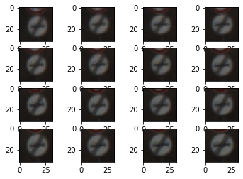
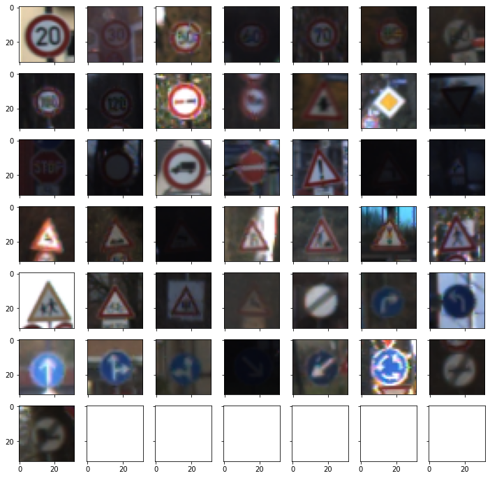
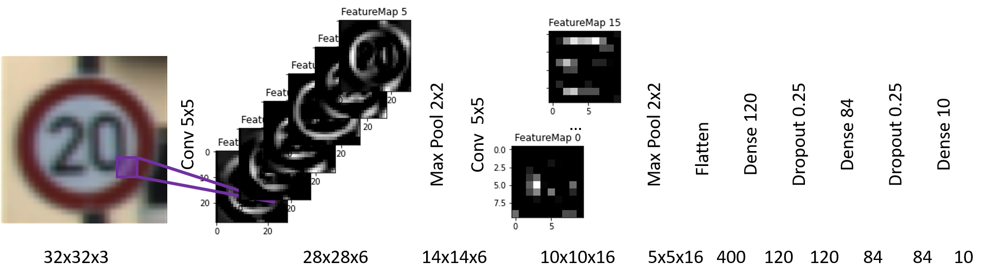
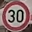
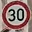
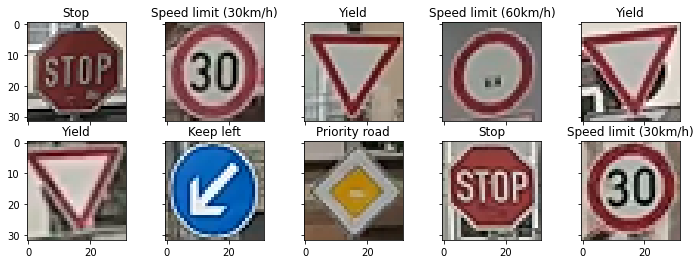
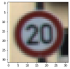
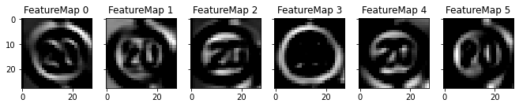
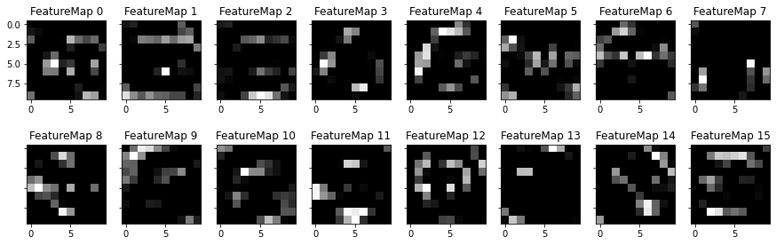

# **Traffic Sign Recognition** 

We built a **Neural Network for Traffic Sign Recognition** and achieve about **95% accuracy** on unseen images. The steps of this project were the following:
* Load the German Traffic Sign Recognition dataset
* Explore, summarize and visualize the dataset
* Design, train and test a model architecture
* Use the model to make predictions on new images
* Analyze the softmax probabilities of the new images
* Summarize the results with a written report

---
## Submission files
This project was carried out in a Jupyter notebook. Here, we provide the write-up of the main findings. The relevant files are:
 * [Jupyter notebook with code](Traffic_Sign_Classifier.ipynb)
 * [HTML export of the notebook](Traffic_Sign_Classifier.html)
 * A write-up report - you are reading it! :) 

---
## 1. Dataset Summary & Exploration

### 1.1 Basic Dataset Summary
The German Traffic Sign Recognition dataset is available by Ruhr University Bochum - [link](https://benchmark.ini.rub.de/gtsrb_news.html). In video of dashcam drives, traffic signs were detected and classified by humans: 

Here, we work on crops of traffic signs resized to 32x32 pixels in colored 3-channel RGB. A total of 51839 images is split into a training, validation, and test set. The dataset comprises a variety of traffic signs with as many as 43 unique classes. 

|Dataset Property   | Value | Percentage of Total |
|-----------        |-------|---------------------|
|Training examples  | 34799 | 67.1%   
|Validation examples| 4410  | 8.5%
|Test examples      | 12630 | 24.4%
|Total examples     | 51839 | 100.0% 
|Unique classes     | 43    | -/-
|Image size         | 32x32x3| -/-

### 1.2 Exploratory Dataset Visualization

To familiarize ourselves with the dataset, we visualize a few examples of the training dataset. The following figure shows the 16 first examples of the training dataset. 

We can see that all 16 examples show the same class of traffic sign, namely "end of no passing". Beyond sharing the same class, the 16 examples are visually similar: above all "end of no passing" signs, the lower end of another red-circled traffic sign appears at the upper edge of the example; the background of all examples is a dark gray; and all examples show a gray metal sign post at their lower end. 
The visual similarity of the images lets us suspect that the first 16 examples all are depictions of the very same physical object detected in subsequent frames of the dashcam video. 

Very similar traffic signs in subsequent training examples, as observed here, pose a challenge to machine learning algorithms. Our objective is to maximize accuracy over the full dataset which we algorithmically achieve by minimizing the discrepancy of model predictions vs ground truth labels. 
When memory restrictions and dataset size no longer allow calculating gradients over the full dataset, training is performed in batches. An overrepresentation of very similar examples in one batch will lead to batch gradients which no longer are a good estimate of gradients over the full dataset and will result in underperformance. 

The following figure shows all 43 unique classes through the first occurrence of a class example in the dataset.

 We first note poor lighting conditions for many examples, with three examples (3rd row, 6th column; 4th row, 3rd column; 6th row, 4th column) failing to be identified by us. From identifying 40 out of 43 examples, we derive a quick estimate of human performance on this dataset of 40/43 = 93%&pm;4%. 

 We observe that the pairs of signs ("no passing", "end of no passing"); ("speed limit 80", "end of speed limit 80"); and ("no passing for trucks", "end of no passing for trucks") only differ in their color and the gray stroke across the sign. We conclude that for the problem at hand, color yields important information.  

## 2. Design and Test a Model Architecture

### 2.1 Data Preprocessing

#### 2.1.1 Shuffling
To combat the observed issue of very similar traffic signs in subsequent training examples, we shuffle the data. Algorithmically, we make use of the scikit-learn `shuffle` function, see code cell `[9]` of the notebook. 

#### 2.1.2 Normalization
Neural networks work best with normalized data with (roughly)feature-wise zero mean and unit variance in the input data. For images with RGB values from 0 to 255, a shorthand `normalized = (raw - 128)/128` exists. The shorthand shifts the data such that all the input values range from -1 to 1. A more general approach, applicable not only to image data, is to normalize using the distribution's mean and standard deviation, which we use here: `normalized = (raw - µ(raw))/σ(raw)`, where µ and σ specify the mean and standard deviation, respectively. 
We check the effect of data normalization and find that normalizing with µ and σ yields a 1.4% improved validation accuracy of our model compared with the shorthand (95.7% vs 94.3%). 

#### 2.1.3 Data Augmentation
No data augmentation was performed. 

### 2.2 Model Architecture
We base our model on the previously used LeNet-5, adapt the network to process colored 3-channel RGB images, and - see the discussion in 2.4 - expand it to include dropout layers for better abstraction. 
 

| Layer         		|     Description	        |    Output     | 
|:---------------------:|:-------------------------:|:-------------:| 
| Input         		| 32x32x3 RGB image			|               |
| Convolution 5x5     	| 1x1 stride, valid padding | 28x28x6 	    |
| ReLU					|							|           	|
| Max pooling	      	| 2x2 stride                | 14x14x6       |
| Convolution 5x5	    | 1x1 stride, valid padding | 10x10x16      |
| ReLU					|							|				|
| Max pooling	      	| 2x2 stride                | 5x5x16        |
| Flatten               |                           | 400           |
| Dense         		| 							| 120           |
| ReLU					|							|				|
| Dropout         		| drop rate = 0.25			|               |
| Dense         		| 							| 84            |
| ReLU					|							|				|
| Dropout         		| drop rate = 0.25			|               |
| Dense         		| 							| 10            | 
| Softmax				|							|   			|

### 2.3 Model Training
The model was trained on a small laptop GPU (Nvidia Quadro T1000) with 4 GB RAM. In order to efficiently utilize the GPU, we increased the batch size until we ran out of memory. While initial smaller models like the LeNet-5 base model allowed for much larger batch size beyond 1000, our final model described in 2.2 trains with batch size 128. 

We used an Adam optimizer and trained with a learning rate of 0.001. Choosing a significantly larger learning rate, such as 0.01 or 0.003, lead to a lower training accuracy.  
| Learning Rate    		|  Training Accuracy at Epoch 20  |
|:---------------------:|:-------------:|
| 0.01                  |   0.948 |
| 0.003                 |   0.997 |
| 0.001                 |   0.999 |

Regarding the training epochs, we started our experiments with 10 epochs (as in the previous LeNet lab). Due to the increased number of parameters of our final model with respect to the base LeNet model and a still increasing validation accuracy at epoch ten, we suspected an increase in training epochs to be beneficial for model accuracy. As our experiments show, the validation accuracy indeed increased between epoch 10 and 20. 

| Epoch | Train Acc.    | Val. Acc. | 
|:------|:-------------:|:---------:|
| 1     | 0.800         | 0.705     |
| ...   |
| 8     | 0.990         | 0.935     |
| 9     | 0.991         | 0.940     |
| 10    | 0.995         | 0.949     |
| ...   |
| 18    | 0.997         | 0.955     |
| 19    | 0.998         | 0.954     |
| 20    | 0.999         | 0.962     |

### 2.4 An Iterative Approach to Model Design

Our final model achieved
| Train Acc.    | Val. Acc. | Test Acc. |
|:-------------:|:---------:|:---------:|
| 0.999         | 0.962     | 0.942     |

and thus exceeds requirements of 0.93 validation accuracy. 

To arrive at our final model, we followed an iterative approach. We started with the previously employed LeNet-5 model. In the original LeNet-5 version, the first layer consists of a 5x5 pixel wide convolutional layer turning 1-dimensional grayscale input images into 6-dimensional feature maps. Thus, the weights of the first layer of the original LeNet-5 are of dimension 5x5x1x6. In order to make the LeNet-5 work on the German Traffic Sign dataset with 3-channel RGB input images, we altered the first layer to accept 3-dimensional colored RGB data by changing the weights from their original 5x5x1x6 dimensionality to a 5x5x3x6 dimensional structure. 

In order to gain insights into whether our model is under- and/or over-fitting, we studied training and validation accuracy for each epoch. Our 3-channel input LeNet model, i.e. the final model without the dropout layers or drop-rate 0.0, achieved training accuracy acc_train = 0.991 at epoch 10, however only achieved validation accuracy acc_val = 0.898 at epoch 10. While this model is not perfectly able to predict the type of traffic sign in the training set with a gap of gap_train = 1 - acc_train = 0.009, we see that the gap between the model's training accuracy and the model's validation accuracy gap_val = acc_train - acc_val = 0.991 - 0.898 = 0.093 is more than a factor of ten larger. In such a situation, it is generally advisable to invest in techniques which lead to a better generalization of the model. 

To achieve a better generalization, we added two dropout layers to arrive at our final model, described in Section 2.2 of this write-up. For the dropout rate, we choose an initial value of 0.25 (without further optimizing its value). The table below shows the effect of the dropout layer, which indeed strongly increases validation accuracy. (We attribute the change in training accuracy to randomness. For future work, we suggest to control not only the TensorFlow random generator, see the line `tf.random.set_random_seed(123)` in code cell 18 of the jupyter notebook, but also the randomness of the scikit-learn `shuffle` function via its `random_state` argument.)
|Dropout Rate   | Train Acc. at Epoch 10    | Val. Acc. at Epoch 10 |
|:-------------:|:-------------------------:|:---------------------:|
| 0.0           | 0.991                     | 0.898                 |
| 0.25          | 0.995                     | 0.949                 |

The LeNet-5 applied to the MNIST dataset achieved training accuracy of 0.999 within 10 epochs in our previous LeNet lab which leads us to suspect that a 0.999 training accuracy is possible with our final model architecture. As discussed in Section 2.3, we also observe the accuracies still improving at epoch 10 and therefore increase the number of training epochs to 20 to arrive at our final results of 0.999 training accuracy and 0.962 validation accuracy at epoch 20 (quoted at the top of this section).

## 3. Test a Model on New Images

### 3.1 Ten new German traffic signs

In order to further test the performance of the developed traffic sign classification algorithm, I independently collected further images of German traffic signs. Here are ten German traffic signs which I gathered with a dashcam car-ride in Frankfurt, Germany: 

All images are pictures taken in real-life. As such all images suffer from imperfect illumination, degradation through weather effects and general aging. In contrast to symbolic representations of traffic signs, red parts of an image are not represented as 255,0,0 in RGB. Having been collected in a dashcam ride, all images suffer from a non-perfect perspective, i.e. none of traffic signs does directly point towards the observer. Particular for this urban dataset is the presence of stickers on the traffic signs, especially for image 01-stop-sign, 04-no-vehicles, and 08-priority. All the images also show an urban background with house structures and edges which might confuse the network, only image 04-no-vehicles shows an almost uniform gray background. 

### 3.2 Predictions on new traffic signs

The following figure exhibits the ten new traffic signs together with their predicted classes:

All but one traffic signs are correctly classified, leading to a test accuracy of 90%. The sign 04-no-vehicles is misclassified as speed limit 60 km/h. Here, one notes the sticker in the center of the no vehicle sign. The black of the sticker in the center of the sign to the network looks like a part of black numbers, such as 60, and thus causes the misclassification. We just witnessed an (unintentional) attack with adversarial stickers. 
Other signs with stickers, namely 01-stop-sign and 08-priority, do not suffer from misclassification: the sticker does not make them resemble a different class of traffic sign. 

### 3.3 Certainties of predictions

 To assess how certain the model is in prediction the classes of the ten new images, we provide here the top5 softmax probabilities for all ten pictures. The code for obtaining these probabilities is located in the 38th code cell of the Jupyter notebook.

Traffic Sign | 1st pred. | 2nd pred. | 3rd pred. | 
|:----------:|:--------------:|:---------:|:---:| 
01-stop-sign | 9% Stop | 4% General caution | 3% Traffic signals 
02-speed-limit-30| 22% Speed limit (30km/h) | 6% Speed limit (20km/h) | 4% Stop
03-yield | 76% Yield | 26% Priority | 19% Turn left ahead
04-no-vehicles | 6% Speed limit (60km/h) | 5% Speed limit (50km/h) | 5%  No passing
05-yield | 42% Yield | 19% No passing | 15% Priority road 
06-yield | 60% Yield | 21% Priority road | 14% Turn left ahead
07-keep-left | 26% Keep left | 16% Turn right ahead | 12% Go straight or left 
08-priority | 41% Priority road | 12% No entry | 1% End of no passing 
09-stop | 17% Stop | 6% Yield | 1% No entry 
10-speed-limit-30 | 18% Speed limit (30km/h) | 11% Speed limit (20km/h) | 7% General caution

The model has the lowest certainty for the mispredicted 04-no-vehicles, both in terms of lowest probability of the top1 prediction and smallest gap between the 1st prediction and the 2nd prediction. 
This observation tells us that we can likely identify mispredictions without access to ground truth labels. This points us to active learning techniques where likely mispredicted data is sent to human labellers to build most-effective datasets for today's autonomous vehicles.

## 4. Visualizing the Neural Network 
In order to gain insight into the inner workings of the neural network, we visualize the feature maps generated by the convolutional layers of our network. 

While it is generally hard to describe the features with words, feature map 3 produced by the first convolutional layer clearly highlights all red parts of the image. Noteworthy here is that the white parts of the image - with white being 255,255,255 in RGB encoding and thus having its red channel maxed out - does not show activation. The feature maps of the first convolutional layer generally resemble the input image, with features such as edges, colors etc being highlighted. Besides feature map 3 and feature map 5, a human can identify the class of the traffic sign 'speed limit (20km/h)' from just one feature map of the first convolutional layer. The feature maps of the second convolutional layer do not allow a human to perform such reconstruction: they are entirely abstract representations of the image. 

